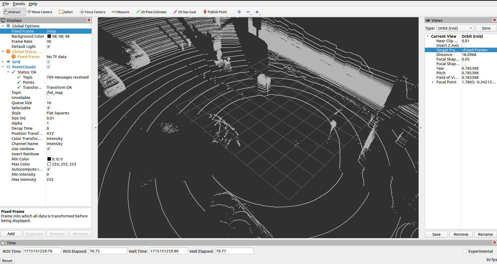
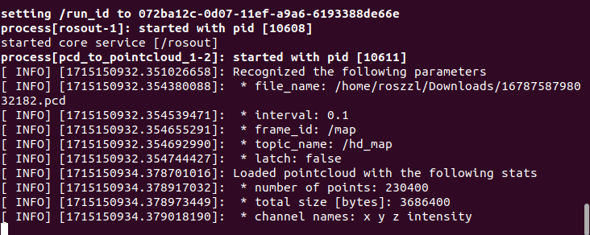

# pcd_pub_ros
This package is to vizualize a pcd file using PointCloud2. 

[](https://wiki.ros.org/noetic)

[](LICENSE)

[](https://github.com/https://img.shields.io/github/release/zhz03/pcd_pub_ros/releases)

[](https://docs.ros.org/en/)[](https://docs.ros.org/en/)[](https://docs.ros.org/en/)

## Overview

This ROS package provides functionality for vizualization of up to 2 pcd files with point cloud. 



## Features
- Allows the user to visualize point clouds and markers from collected data on RViz
- Streams raw points and data in pcd files to ROS topic for visualization

## Installation
### Prerequisites
- ROS (Robot Operating System) Noetic installed on Ubuntu 20.0.4
- C++ 14
- Catkin

```bash
sudo apt install catkin
```

### Installation Steps
If your catkin workspace is not set up, refer to [the ROS workspace setup tutorial](http://wiki.ros.org/catkin/Tutorials/create_a_workspace) to set up the catkin workspace first. If it is already setup, proceed to next step.

To build from source, clone the repository into your ROS workspace and compile:

```bash
cd ~/catkin_ws/src
git clone https://github.com/zhz03/pcd_pub_ros
```

Then navigate to the workspace and build the package:
```bash
cd ~/catkin_ws
catkin_make
```

Source the ROS setup script:
```bash
source devel/setup.bash
```

## How to Use

This ROS package is intended to be run using a pcd data file. Using a file explorer, navigate to the pcd file(s) you want to visualize. 

In a separate file explorer window, navigate to the launch folder within the pcd_pub_ros package. The launch folder's file path will be of the following form. 
```bash
~/catkin_ws/src/pcd_pub_ros/launch
``` 

Open the launch file that you plan to use in a text editor. The cloned package includes three pre-configured launch files. 

Within the text editor, for any argument (<arg>) with name "pcd_file1" or "pcd_file2", replace the default filepath (default=) with the filepath of the pcd data file(s) you want to visualize. 

Save the launch file and close the text editor. 

Open a terminal window, then change the current working directory to the ROS workspace containing the pcd_pub_ros directory. 

If you have not done so within this terminal session, run the following command to enable ROS commmand use: 
```bash
source devel/setup.bash
```

Run a launch file from the pcd_pub_ros package using the ROS launch command template below, replacing LAUNCH_FILE with the .launch file associated with the desired launch configuration: 
```bash
roslaunch pcd_pub_ros [LAUNCH_FILE]
```

Note that the previously mentioned ROS launch command should be run from the top ROS workspace directory. 

If launch is successful, you will get output displaying information on your pcd data, which we will use later. 

Open another terminal window, and open RViz using: 
```bash 
rviz 
``` 

- Add a new display by clicking the "Add" button in the bottom left corner and selecting the "PointCloud2" option from the window prompt. 

- Click the arrow to the left of the new "PointCloud2" display to view more information on the display. 

- Change the "Topic" field within RViz's PointCloud2 menu to the topic name of the pcd file. This topic name should be an option in the selector's dropdown list--enter manually if needed. 

- Change the "Fixed Frame" field within RViz's global options to match that of the frame ID. 

- Note that if the frame ID begins with a slash (/), you will likely need to begin with two slashes, since one will be automatically removed. 

- Click the "Reset" button in the bottom left corner of the RViz window to play the pcd data from its start.

- You will see the pcd file PointCloud2 data running in RViz. 

- The pcd file can be run as many times as needed while using the same RViz setup. 

### Example Usage

Suppose you wanted to visualize a pcd file with the following directory via PointCloud2: 
```bash
~/Downloads/1678758798032182.pcd
```

The directory of the ROS workspace containing the pcd_pub_ros package is: 
```bash
~/pcd_ros_ws
```

Open a terminal window, then run the following to enable ROS commands in the ROS workspace: 
```bash
cd ~/pcd_ros_ws 
source devel/setup.bash
```

Suppose the configuration you want is implemented by the launch file "launch_1pcd.launch". Then, we would run the following: 
```bash
roslaunch pcd_pub_ros launch_1pcd.launch
```

In the case of this example pcd file, the associated rostopic name is "/hd_map", with frame id "/map". 


Now, you can open a second terminal and run the following to open RViz: 
```bash
rviz
```

- Add a display by clicking the "Add" button in the bottom left corner of the RViz window, then selecting "PointCloud2". 

- Enter our PointCloud2 topic "/hd_map" in the "Topic" field that appears within the PointCloud2 display. 

- Under the Global Options "Fixed Frame" field, enter the name of our frame ID, "/map". 
- Note that in this example, you may need to type "//map", which will correct to "/map". 

- We can now hit the reset button in our RViz window.  The visualization should look similar to the following: 


